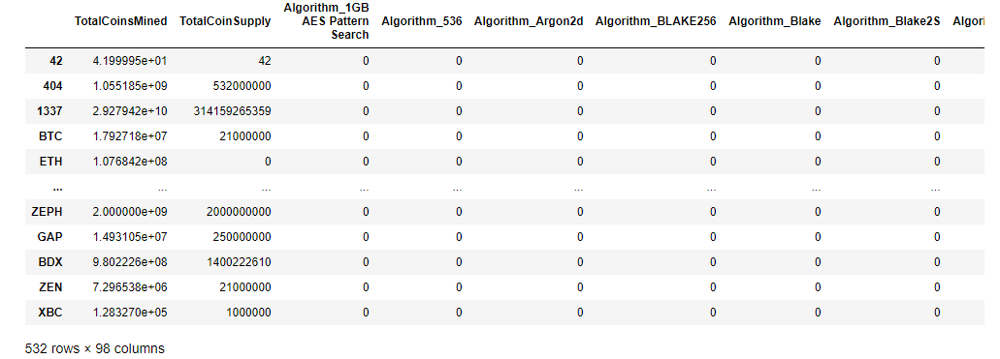
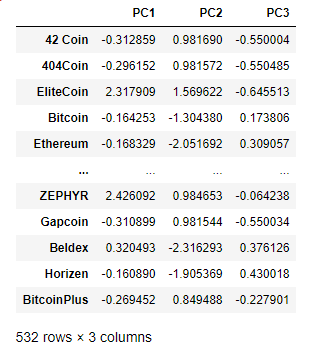
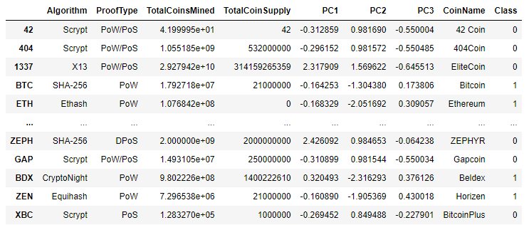
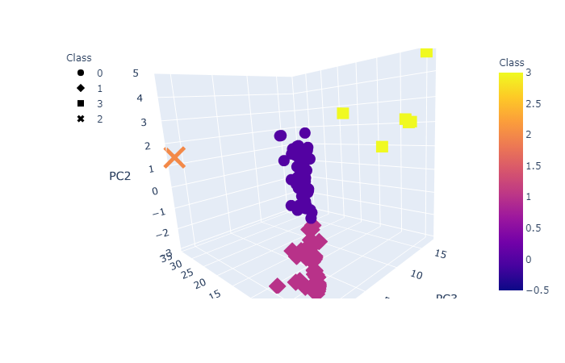
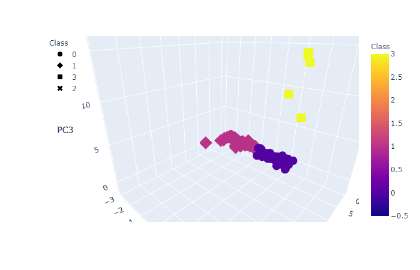
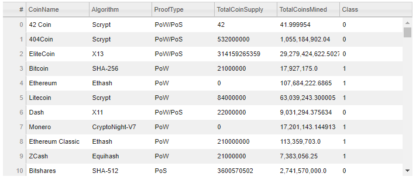
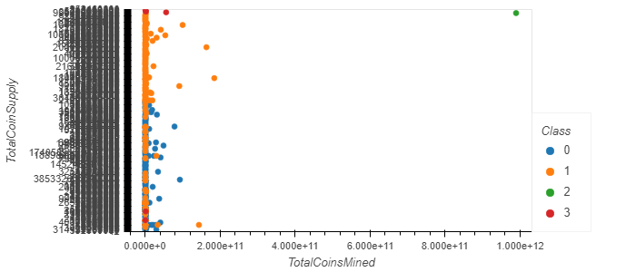

# Cryptocurrencies

This challenge, uses unsupervised learning to analyze data on the cryptocurrencies traded on the market. 

## We follow the general steps of: 
<b>Data Preprocessing</b> 
Cleaned the data of "bad/unneeded" values. Ending with converting the text data to numeric using dummies 

<b>Reducing the data dimensions leveraing PCA</b> 
Used Principal Component Analysis to reduce the dimensions down to the suggest (3) PCs 

<b>Clustering the cryptocurrencies using K-means</b> 
Using Intertia & and Elbow to determine that the approriate K=4 for clustering 

Then created a new summary Dataframe with the cryptocurrency information and the PCA values 

<b>Finally creating a few visualizations</b> 

